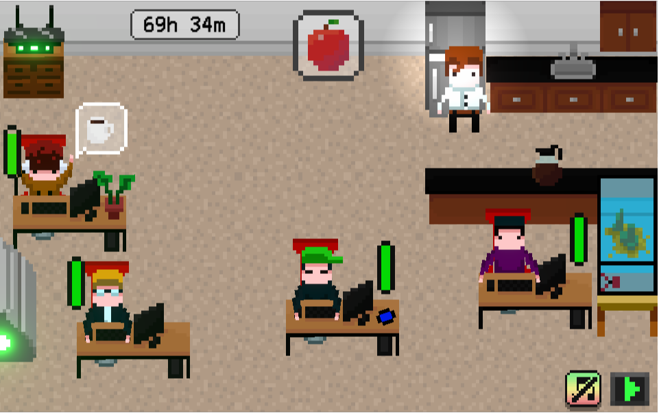
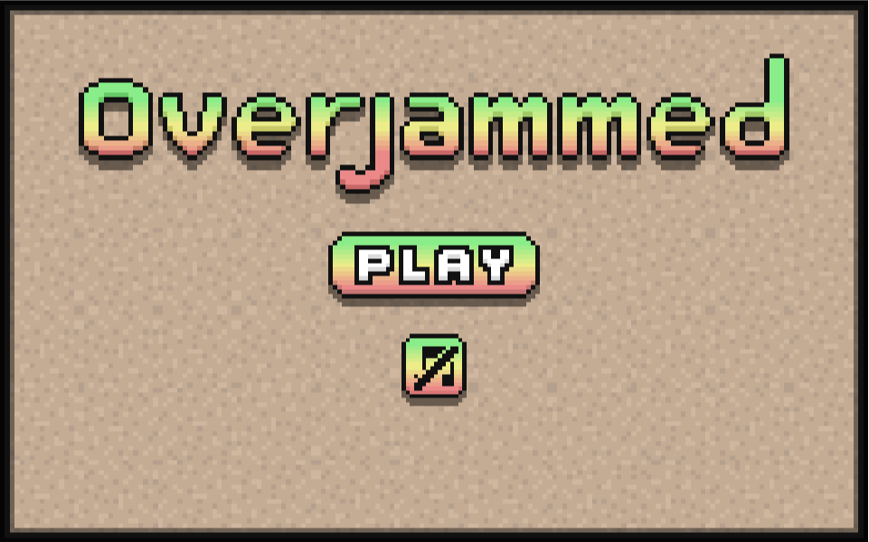
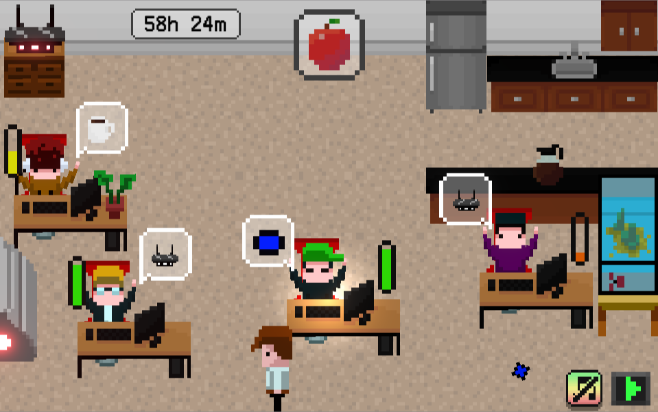

# Overjammed

Game made in 72 hours for a Game Jam called [Ludum Dare](ldjam.com/)  
You can play it [**here**](https://nachodlv.itch.io/overjammed)!  

## Introduction
The Game Jam has started. You must make sure the devs keep on working until the end. Bring them what they need, take care of what’s annoying them and motivate them so they don’t give up.

Keep the team alive!

## Instructions
- Move using the arrow keys
- Press space to interact with things (or cancel the interaction if you are in one)

## Contributors
- [Juan Bautista Arambarri](https://github.com/JuanArambarri) - Composer 
- Joel Eduardo Aguirre - Artist
- [Eduardo Lalor](https://github.com/Dwape) - Artist

## Screenshots

